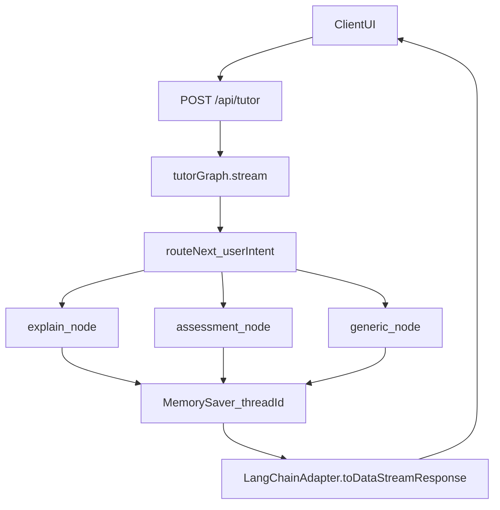

## LangGraph Ollama Tutor Agent

一個基於 **LangGraph**、**Ollama Llama3** 與 **Vercel AI SDK** 打造的本機教學型 AI 導師 API。  
它將 LLM 包裝成具備「狀態機 + 記憶 + 人機協作中斷點」的導師 Agent，適合拿來教學、做 demo 或當作你自己 Agent 專案的起手模板。

---

## 功能特色

- **教學導師 Agent**
  - 使用 `TutorState` 擴充 `MessagesState`，內建對話歷史 (`messages: BaseMessage[]`)。
  - 追蹤學習等級 `LearningLevel = 'beginner' | 'intermediate' | 'advanced'`。
  - 記錄使用者已掌握的術語 `termsMastered` 與專案進度 `projectProgress`。

- **多節點流程 (LangGraph StateGraph)**
  - `explain` 節點：根據目前等級解釋 Agent 相關觀念。
  - `assessment` 節點：用 JSON 結構評估回答正確與否並更新等級、術語。
  - `generic` 節點：一般問候與閒聊，用於初次進來或無特別意圖時。
  - `routeNext` 根據 `userIntent` 在上述節點間路由。

- **本機 Llama3 via Ollama**
  - 使用 `@langchain/ollama` 的 `ChatOllama` 直接打本機 Ollama 服務：
    - `model: "llama3"`
    - `baseUrl: "http://localhost:11434"`
    - `temperature: 0.7`，適合教學導師。

- **中斷點 (Human-in-the-loop)**
  - 利用 `interruptBefore: ["assessment"]` 在進入評估節點前強制中斷。
  - 讓真人助教有機會檢查學生作答與 AI 評分，再決定是否繼續流程。

- **記憶與持久化介面**
  - 使用 `MemorySaver` 作為最簡單的 in-memory checkpointer。
  - 透過 `thread_id` 區分不同學生 / 不同對話執行緒。
  - 架構上可以輕鬆換成 `PostgresSaver`、`MongodbSaver` 等持久化方案。

- **Vercel AI SDK 整合**
  - 使用 `LangChainAdapter.toDataStreamResponse` 將 LangGraph 的 streaming 結果轉成 HTTP 串流回應。
  - 適合接到 Next.js `app` router (`app/api/tutor/route.ts`) 或 Edge Runtime。

---

## 系統需求

- **Node.js**: 建議 `>= 18`（內建 `fetch` 並較適合搭配 Next.js / Edge）。
- **Ollama**:
  - 已安裝 Ollama 並可在本機執行。
  - 需先拉取並啟動 `llama3` 模型：

```bash
ollama pull llama3
ollama run llama3
```

- **NPM 套件依賴**（見 `package.json`）：
  - `@langchain/langgraph`
  - `@langchain/core`
  - `@langchain/ollama`
  - `ai`
  - `@ai-sdk/langchain`

---

## 安裝與整合方式

1. 在你的專案中安裝依賴：

```bash
npm install @langchain/langgraph @langchain/core @langchain/ollama ai @ai-sdk/langchain
```

2. 將本專案的 `route.ts` 放入 Next.js `app` router 之下，例如：

- `app/api/tutor/route.ts`

3. 確保 Ollama 正在本機執行且位址與程式碼一致：

- 目前程式中 `ChatOllama` 的設定為：

```ts
const model = new ChatOllama({
  model: "llama3",
  baseUrl: "http://localhost:11434",
  temperature: 0.7,
});
```

如果你的 Ollama 不在預設位址，請調整 `baseUrl` 或改成讀環境變數（建議實務上這樣做）。

---

## 架構與資料流

整體架構可以想成：前端丟訊息 + `threadId` 到 API，API 把訊息丟進 LangGraph 的 `tutorGraph`，依 `userIntent` 跑不同 node，更新 `TutorState`，最後以串流方式回傳。



### TutorState 與狀態欄位

`TutorState` 基於 `Annotation.Root` 建立，整合了系統需要追蹤的所有欄位：

```ts
export const TutorState = Annotation.Root({
  ...MessagesState.spec, // messages: BaseMessage[]

  termsMastered: Annotation<string[]>({
    reducer: (x, y) => x.concat(y),
    default: () => [],
  }),

  currentLevel: Annotation<LearningLevel>({
    reducer: (x, y) => y ?? x,
    default: () => "beginner",
  }),

  projectProgress: Annotation<string[]>({
    reducer: (x, y) => x.concat(y),
    default: () => [],
  }),

  userIntent: Annotation<"answering" | "confused" | "generic">({
    reducer: (x, y) => y ?? x,
    default: () => "generic",
  }),
});
```

- **messages**: 透過 `MessagesState.spec` 內建，存放整個對話序列。
- **termsMastered**: 紀錄學生已掌握的關鍵術語，使用 concat reducer 疊加。
- **currentLevel**: 現在的學習等級，新的值會覆蓋舊的值。
- **projectProgress**: 可用來記錄學生完成了哪幾個練習或任務。
- **userIntent**: Router 使用的關鍵欄位，決定要走哪個 node。

---

## 節點與路由邏輯

### explainNode：解釋觀念

```ts
export async function explainNode(state: typeof TutorState.State) {
  console.log("--- 進入 EXPLAIN 節點 ---");

  const systemPrompt = {
    role: "system",
    content: `你是一位 Agent 導師。目前學生的等級程度是:
    ${state.currentLevel}。請用淺顯易懂得方式解釋agent以
    及學習打造agent所需要學習的概念以及知識`,
  };

  const response = await model.invoke([systemPrompt, ...state.messages]);

  return {
    messages: [response],
    termsMastered: ["Planning"],
  };
}
```

- 利用 `ChatOllama` 的 `model.invoke` 直接餵入 system prompt + 歷史訊息。
- 回傳的 `messages` 會被 LangGraph merge 回 `TutorState`，並把 `"Planning"` 加入 `termsMastered`。

### assessmentNode：評估學生理解

```ts
export async function assessmentNode(state: typeof TutorState.State) {
  console.log("--- 進入 ASSESSMENT 節點 ---");

  const systemPrompt = {
    role: "system",
    content: `你是一位 AI 導師。請評估學生的回答並直接回傳一個 JSON 物件，格式如下：
    {
      "feedback": "你對某觀念的評價...",
      "isCorrect": true,
      "masteredTerm": "觀念名稱"
    }
    請注意：只回傳 JSON，不要說任何廢話。`,
  };

  const response = await jsonModel.invoke([systemPrompt, ...state.messages]);

  try {
    const data = JSON.parse(response.content as string);

    return {
      messages: [{ role: "assistant", content: data.feedback }],
      currentLevel: nextLevel,
      termsMastered: data.isCorrect ? [data.masteredTerm] : [],
    };
  } catch (error) {
    console.error("AI 回傳格式錯誤:", error);
    return {
      messages: [
        {
          role: "assistant",
          content: "抱歉，我剛剛分心了，請再跟我說一次你的答案。",
        },
      ],
    };
  }
}
```

- 強制 LLM 以純 JSON 回傳，程式端用 `JSON.parse` 把文字轉成結構化資料。
- 根據 `isCorrect` 決定要不要新增 `masteredTerm`。
- 若 JSON 格式壞掉則進入 `catch`，傳回一段友善的錯誤訊息。

> 注意：程式碼中 `jsonModel` 與 `nextLevel` 等細節需保證有正確定義；在實務專案中建議再補上嚴格的 schema 驗證與等級升級邏輯。

### genericNode：一般對話

```ts
export async function genericNode(state: typeof TutorState.State) {
  console.log("--- 進入 GENERIC 節點 ---");

  const response = {
    content: "你好！我是你的 AI 導師。你想從哪個 Agent 觀念開始學起？",
  };

  return {
    messages: [response],
  };
}
```

- 主要作為初始進入點或 fallback，給一段友善問候文字。

### routeNext：決定下一個節點

```ts
function routeNext(state: typeof TutorState.State) {
  const intent = state.userIntent;

  if (intent === "answering") {
    return "assessment";
  } else if (intent === "confused") {
    return "explain";
  } else {
    return "generic";
  }
}
```

- 根據 `userIntent` 決定要把流程送到哪個 node。
- 目前 `POST` handler 將 `userIntent` 固定寫成 `'generic'`，所以除非你在其他地方更新 state，預設會一直走 `generic` 節點；這在 README 的「擴充建議」有特別提到。

### tutorGraph：組裝整個 StateGraph

```ts
const workflow = new StateGraph(TutorState)
  .addNode("explain", explainNode)
  .addNode("assessment", assessmentNode)
  .addNode("generic", genericNode)
  .addConditionalEdges(START, routeNext, {
    explain: "explain",
    assessment: "assessment",
    generic: "generic",
  })
  .addEdge("explain", END)
  .addEdge("assessment", END)
  .addEdge("generic", END);

export const tutorGraph = workflow.compile({
  checkpointer: checkpointer,
  interruptBefore: ["assessment"],
});
```

- `START` → `routeNext` → 對應 node → `END`。
- `checkpointer` 使用 `MemorySaver`，配合 `thread_id` 來維持每個學生的狀態。
- `interruptBefore: ["assessment"]` 讓系統在進入 `assessment` 之前暫停，實作 human-in-the-loop。

---

## API 介面說明

### 路由

- `POST /api/tutor`
  - 假設你將本專案 `route.ts` 放在 `app/api/tutor/route.ts`。

### Request Body

```json
{
  "threadId": "student-123",
  "messages": [
    { "role": "user", "content": "我想學怎麼打造一個 Agent" }
  ]
}
```

- **threadId**: 用來區分不同學生或不同對話執行緒，如果省略會 fallback 到 `"default-student"`。
- **messages**: 前端目前累積的對話訊息陣列，會透過 `toBaseMessages` 轉成 LangChain 格式。

### Handler 實作概覽

```ts
export async function POST(req: Request) {
  const { messages, threadId = "default-student" } = await req.json();

  const langchainMessages = toBaseMessages(messages);

  const eventStream = await tutorGraph.stream(
    {
      messages: langchainMessages,
      userIntent: "generic",
    },
    {
      streamMode: "values",
      configurable: { thread_id: threadId },
    }
  );

  return LangChainAdapter.toDataStreamResponse(eventStream);
}
```

- `tutorGraph.stream` 會回傳一個 event stream，內含節點輸出與更新後的 state。
- `LangChainAdapter.toDataStreamResponse` 會將這個 stream 包裝成 HTTP 串流回應，方便前端以 SSE 或 chunked 方式消費。

### 前端簡易呼叫範例

純粹示意，實際上你可以用 Vercel AI 的前端 SDK 或其他 streaming 客戶端：

```ts
async function callTutorApi(message: string, threadId = "student-123") {
  const res = await fetch("/api/tutor", {
    method: "POST",
    headers: { "Content-Type": "application/json" },
    body: JSON.stringify({
      threadId,
      messages: [{ role: "user", content: message }],
    }),
  });

  // 如果你不需要 streaming，也可以先簡單用 res.text() 看內容
  const text = await res.text();
  console.log(text);
}
```

實務上建議直接用 Vercel AI 的前端 hook（例如 `useChat` 等）處理串流與狀態管理，這裡就不贅述。

---

## 擴充與客製化建議

- **新增更多 userIntent 與節點**
  - 例如：`"projectHelp"`, `"quiz"`, `"codeReview"` 等，並對應新增 node。
  - 調整 `routeNext` 讓 router 根據新的 intent 做更細緻分流。

- **動態 intent 分類**
  - 目前 `POST` handler 將 `userIntent` 寫死為 `'generic'`。
  - 實務上可以在進 LangGraph 前先用一個輕量 LLM 或規則分類器分析最新訊息，決定要用哪個 intent。

- **替換 MemorySaver 為真正的 DB**
  - 若你希望對話可以跨機器、跨重啟保留，應改用 `PostgresSaver`、`MongodbSaver` 等實際資料庫方案。
  - 結構上只要替換 checkpointer 實作即可，Graph 其餘邏輯可保持不變。

- **改用雲端 LLM Provider**
  - 如果不想依賴本機 Ollama，只要把 `ChatOllama` 換成其他 LangChain-compatible LLM（如 OpenAI, Anthropic, etc.），並調整初始化與 import。

- **環境變數化設定**
  - 建議將 `model` 名稱、`baseUrl`、溫度、JSON schema 等，全部提到 config 或環境變數，方便在不同環境部署。

---

## 開發與除錯 Tips

- **啟動 Next.js 開發伺服器**
  - 將本檔案整合到你的 Next.js 專案後，照原專案腳本（例如 `npm run dev`）啟動即可。

- **觀察節點 log**
  - 每次進入節點時，console 會印出：
    - `"--- 進入 EXPLAIN 節點 ---"`
    - `"--- 進入 ASSESSMENT 節點 ---"`
    - `"--- 進入 GENERIC 節點 ---"`
  - 可以用來確認 router 行為是否如預期。

- **檢查 Ollama 狀態**
  - 確認 Ollama 服務有在跑、模型已載入：

```bash
ollama list
curl http://localhost:11434
```

- **處理 JSON 解析錯誤**
  - 若 `assessmentNode` 經常噴 JSON parse error，可以：
    - 放寬 system prompt 要求或改用 `zod` 等 schema 工具做更嚴格驗證。
    - 在 log 中記錄原始回傳內容，方便 debug。

---

## 限制與注意事項

- 目前假設 Ollama 與 API server 在同一台機器，`baseUrl` 未透過環境變數設定。
- `assessmentNode` 強烈依賴 LLM 嚴格遵守 JSON 格式；雖然有 try/catch，但實務上仍建議增加 schema 驗證與 fallback 策略。
- `userIntent` 在範例 handler 中固定為 `'generic'`，不會觸發 `explain` 或 `assessment`，除非你在外部自訂 state 或改寫 handler。
- 專案目前是作為教學 / 範例用途，未包含完整的驗證、授權與觀測性 (observability)。

---

## 授權

此專案授權方式請依上層 repo 或實際發佈時的 LICENSE 為主；如果你是將此範例嵌入個人專案，請自行補上合適的授權說明。

