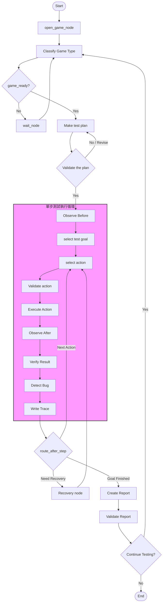

# Project 2: AI Playtesting Agent (微觀狀態機架構 - 已歸檔/待重構)

本專案旨在利用 LLM (Gemini 2.5) 與 Playwright 打造一個能自動測試 Web 遊戲的 AI Playtesting Agent。在經歷兩週的開發後，我們完成了基礎元件的實作與流程驗證，並基於實際測試痛點決定進行架構轉型。

---

## 初始設計架構圖 (微觀狀態機)

以下是我們在第一階段設計的超大型、微觀管理的狀態機工作流 (State Machine Workflow)：

---

## 打造過程與已實現功能

我們在第一階段已成功搭建了核心的基礎設施，實現了以下功能：

1. **瀏覽器管理器 (BrowserManager)**
   * 整合 Playwright 機制，具備自動繞過 GPU 阻擋、支援 WebGL/Canvas 遊戲載入的瀏覽器控制。
   * 實作全域自動資源清理機制 (`atexit.register`)，防止執行中斷導致瀏覽器殘留。
2. **遊戲類型自動分類 (classify_game_node)**
   * 利用 **Gemini 2.5 Flash** 視覺模型，輸入網頁截圖，智慧分類遊戲是 Canvas、HTML UI 還是純文字，並程式化計算置信度 (Confidence)。
   * 內置自動等待載入與重試機制 (`wait_node` + `route_game_ready`)，最大重試 3 次，防止遊戲載入中斷。
3. **測試計畫動態生成 (make_test_plan_node)**
   * 利用 **Gemini 2.5 Pro** 針對已分類的遊戲類型與畫面上視覺線索，動態生成結構化測試計畫（包含測試步驟、QA 推理、關鍵驗證點）。
4. **雙模型驗證環 (validate_test_plan_node)**
   * 實作「生成-驗證」雙模型架構。由 Gemini 2.5 Pro 負責生成，Gemini 2.5 Flash 擔任 Senior QA 審查。驗證未通過時，會附帶拒絕理由（Feedback）回流重新修正計畫。
5. **持久化狀態儲存 (SqliteSaver)**
   * 導入 LangGraph SQLite 檢查點機制，支援隨時暫停、中斷並透過 `run_id` 恢復執行（Resume）的能力。

---

## 為什麼終止當前架構？

雖然已實現的節點工作運作良好，但我們在推進到 `Execution Loop` (單步執行循環) 時，發現了此架構的致命缺陷：

1. **成本與延遲爆炸**：每個動作（Action）都被拆成觀察、選擇、驗證、執行等 7-8 個節點。如果測試一場遊戲需要點擊 20 次，將導致高達上百次的 LLM 呼叫，反應極慢且費用昂貴。
2. **架構極度脆弱**：遊戲環境是高度動態且充滿隨機性的（例如突然的彈窗、網路延遲、隨機事件）。為了在這個微觀狀態機中處理所有例外，我們必須畫出極度複雜的 `conditional edges`，導致圖形難以維護。
3. **狀態污染與膨脹**：為了傳遞單一微觀節點的資料（如局部錯誤、臨時截圖路徑），我們被迫在全域 `PlaytestState` 塞入過多臨時變數，混淆了 LLM 的 Context。

---

## 下一步：重構為真正的 MAS 架構

我們決定將這個「超大型微觀狀態機」重構為符合現代 **Planner-Executor-Critic (規劃-執行-審查)** 的多智能體系統 (MAS)：

* **規劃智能體 (Planner Agent)**：只在全域負責宏觀的「測試案例表」生成與更新，不關心具體點擊與滾動細節。
* **執行智能體 (Executor Agent)**：接收 Planner 的子任務，在其**內部**執行一個輕量級的 ReAct 迴圈（自主觀察、選擇動作、執行 Tool 並修正），直到任務完成。全域圖不再包含微觀的動作執行節點。
* **審查智能體 (Critic Agent)**：在 Executor 跑完任務後介入，分析執行日誌、主控台 Console Log 與截圖，進行客觀的 Bug 偵測與品質評估。

詳細重構反思與分析請見：[reflect.md](file:///c:/Users/kook1/OneDrive/桌面/agent/practice/ai_playtesting/project2_build_my_agent/reflect.md)。
